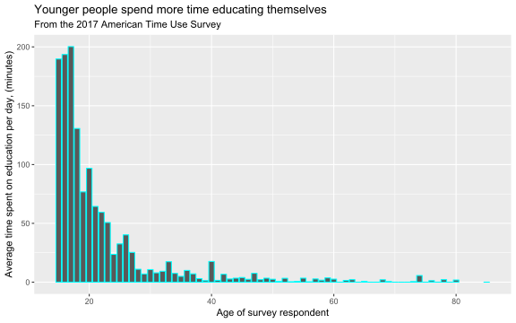
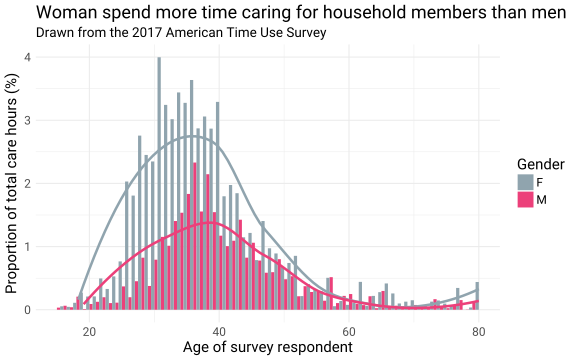
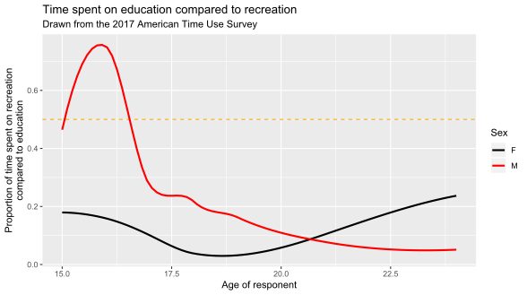

# A Set of Contributed Graphs with brief Commentary

## Authors

- David Firth
- Danius Backis
- James Walsh
- Samuel Hine
- (next name to be added here)

(add your name to the above list when you have contributed your file)

## The contributions

### DAVID F

    08 10 14

This plot shows how participation in religious and spiritual activity in the USA is different at different ages.  The graph is based on data from the 2017 American Time Use Survey, in which
respondents recorded how they spent all of their time on the day before they were interviewed.
The above graph shows the percentage of respondents, at different ages, who reported that they had spent any time at all on religious and spiritual activity on the day in question.

The graph shows how such participation increases from less than 10% of 20-year-olds, to 20% or more of the oldest survey respondents.  It should be noted that the data for the very oldest respondents --- those aged 80 and over --- is less reliable than at other ages, partly because of small numbers and partly because of the rounded recording of older ages in the published ATUS data.
    
**The above is just an illustrative example of the sort of graph and text you might include in this file.  I fully expect that some of the graphs you'll produce will be more interesting than this one!**

          	
### ALEXANDER

    01 06 13

### BAIYUN

    08 13 18    

### BENJAMIN A

    01 05 08
     
### BENJAMIN S

    10 13 18
    
### CHRISTOPHER

    10 14 16
    
### DANA

    05 12 18

### DANIEL

    03 05 11

### DANIUS  

   06 11 14
   
   

The graph above depicts the relationship between the average time spent on educational activities and the age of the respondents. As one would expect, the younger the respondent, the more they spend time educating themselves. The maximum is attained at 17 years old, when people spend on average 200 minutes per day on education, and then it drops quickly. 7 years later, less than 24 minutes per day are spent on education. It can also be noted that from 50 years old participants practically never spend time on education, which I found quite surprising. 

    
### DAVID

    01 02 05
    
### DENIS

    02 03 12
    
### FAN

    06 11 16
    
### HARRISON

    05 15 16
    
### JAMES

    03 08 14
    

The above figure conveys an inequality in both gender and age of individuals caring for members within the American home. Participants of the 2017 American Time Use Survey (ATUS) were expected to note how many hours of the day before their interview they had spent on various tasks. In the graph, we may see the proportion of the total reported hours directed to this care, split by age and sex.

Of all reported hours caring for others within their home, across almost all ages, females (grey) report a higher number of hours than males (pink). Secondly, younger woman (25-35) spend considerably more time on this task than men of the same age range. Interestingly, men do show a clear peak in their late thirties, perhaps correlated to their aging parents seeking their help. The trend lines are provided solely for illustrative purposes of indicating the distinct differences in proportions, as they have not been statistically scrutinized. Similarly, the tails of these rough distributions, and hence these data, should be considered somewhat unreliable due to small sample size within these age ranges.

    
### JAN

    04 13 15
    
### JIA

    07 08 18
    
### LANGLANG

    02 11 18
    
### LEWEI

    01 06 08
    
### LUYING

    06 08 15
    
### MACIEJ

    12 16 18
    
### MAHIR

    04 06 16
    
### MARIIA

    02 06 11
    
### MAXIM

    12 13 16
    
### MICHAEL

    04 10 12
    
### MINWOO

    04 08 12
    
### NAIXUAN

    08 14 16
    
### NATHAN

    11 12 15
    
### NEEL

    04 07 15
    
### NICOLE

    02 06 11
    
### NIRAJ

    03 06 13
    
### OPEOLORUN

    05 16 18
    
### REECE

    09 10 12
    
### RICHARD

    04 11 12
    
### SAMUEL

    06 09 13
    

    
The plot shows the proportion of time people spend on sports and recreation as opposed to education. Note that only people included in this plot are those who _are_ in education. All respondents were specified to have an age under 25, so the graph isn't clouded by the many ages that are not in education. 
The graph shows that males between the 15-17 age bracket spend far more on recreational activites, since the values for these ages fall above the 0.5 line. As the age increases, the proportions through the ages fall together; reason for this could include and increase in difficulty relating to higher eduation.
For females however, the proportion does not change much over time, perhaps due to female students being more motivated in school.
    
### SANDEEP

    02 04 15
    
### SOPHIE

    04 12 18
    
### TIMOTHY

    06 09 11
    
### XI

    03 05 06
    
### XINGWEI

    01 03 07
    
### YIWEN

    02 10 14
    
### YUE

    03 12 18
    
### ZECHI

    01 04 07
    
### ZILIN

    04 10 15

