# A Set of Contributed Graphs with Brief Commentary

This little document is the result of a lab class at Warwick, in *ST344 Professional Practice of Data Analyis*.

Many thanks to all of the students listed below, who contributed a graph!  (Each student was asked to focus on one constituency in one region, in relation to data on the 2015 and 2017 UK General Elections and the 2016 EU Referendum.)

David Firth (as Editor)

## Authors

- David Firth
- Nayia Constantinou
- Jamie Wreathall
- Tina Goldarreh
- Anthony Shaffu
- Kevin Choi
- Alice Saxton
- Alex Flint
- Florence Welsh
- Matt Davies
- Kishan Radia
- Miraj Shah
- Anushka Katailiha
- Declan Wardell
- Matthew James
- Isaac Nelson
- Dan Simpson
- Christopher Geon Young Park
- Diana Ivanova
- Zsigmond Hammer
- Dominic Foong Wen Hao
- Nathan Quinn
- Ollie Harvey

## The contributions

### David

 530       Staffordshire South

This plot shows, for all constituencies in the West Midlands region, the relationship between electoral change (between Conservative and Labour parties, at the 2015 and 2017 General Elections) and the percentage of people aged 18-24 according to the 2011 census.

Perhaps surprisingly, gains for Labour (over the Conservatives) appear to have been largest in those West Midlands seats where there were fewest young people resident according to the census.

The majority of West Midlands constituencies show some gain for Labour over Conservative.  The *Staffordshire South* constituency, highlighted in red in the plot, appears to be fairly typical as far as these two variables are concerned.

**The above is just an illustrative example of the sort of graph and text you might include in this file.  I fully expect that some of the graphs you'll produce will be more interesting than this one!**

### Nayia
57 Birmingham Edgbaston

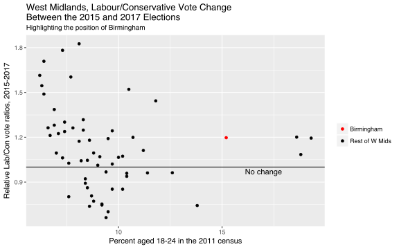

Same plot as Prof. Firth's above but now the *Birmingham Edgbaston* constituency is highlighted in red in the plot. 

The *Birmingham Edgbaston* constituency is similar to the majority of constituencies with regards to the Relative LabCon vote ratios between 2015 and 2017, as it shows some gain for Labour over Conservative. However, it differs from the majority of constituencies with regards to the percentage of people aged 18-24 according to the 2011 census in the West Midlands, as it is one of the 4 consituencies with the largest percentage of young people (above 15%). 

### Alex

 428         Northampton South
 
 
 
 I have looked further into the patterns of young voters in the East Midlands. This plot shows the relationship between electoral turnout changes (between the 2015 and 2017 general elections) and the percentage of the population aged between 18 and 24 from the 2011 census. 

As expected, electoral turnout tended to increase sharply in the constituencies of the East Midlands which had higher percentages of young voters in 2011. However, in all but five East Midland constintuencies there was a increase in percentage turnout in 2017 compared with 2015. 

Northampton South, highlighted in red, showed very typical results for the East Midlands. To build upon these findings I would suggest finding out the proportion of teenagers in each constituency to see if this affects my findings.

### Alice

 289      Hampshire North West
 
 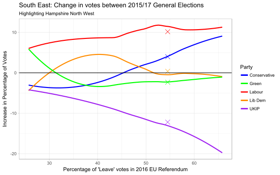
 
 This plot shows the relationship between the increase of each party's percentage of votes for the 2015 and 2017 General Elections, against the estimated percentage of 'Leave' votes in the 2016 EU Referendum. The lines that have been plotted are based on all of the constituencies in the South East. It also highlights the data points that represent the Hampshire North West data for this relationship.

Labour is the only party to not see a decrease in vote percentage across all constituencies, and has the largest increase at all points. However, when considering Hampshire North West, there is not as large an increase as the plot would suggest for a constituency with a Leave percentage of that size. Looking at the plot, a possible explanation for this could be that both the percentages for UKIP and the Lib Dems have not decreased as much as would be expected.

Another interesting pattern in this plot is the almost symmetric shapes of the Conservative and UKIP lines which becomes more pronounced where the Leave percentage is higher. This could suggest that lots of people who voted UKIP in 2015 and supported the outcome of the EU Referendum, then transferred their support to the Conservative Party in the 2017 Election.

### Anthony

 631  Wolverhampton South East
 
 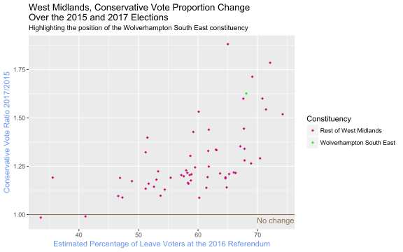
 
 As can be seen from the graph and the correlation value of 0.6142848, there is a fairly strong positive correlation between the variables ConRatio and Leave. In other words, in the constituencies with the larger percentage of “Leave” votes, there was a larger swing of votes to the Conservatives from 2015 to 2017.
 
Wolverhampton South East is among the higher end of the percentage of “Leave” votes and Conservative swing, but it still seems to follow the trend that the other West Midlands constituencies exhibit.

### Anushka

 309  Hertfordshire North East
 
 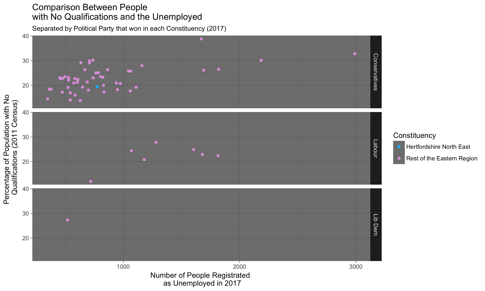
 
 The graph above compares the number of people registered as unemployed in 2017 against the proportion of the population without a qualification in 2011, highlighting Hertfordshire North East's position amongst the rest of the Eastern region. 

An obvious observation is that the Conservative party proved to be quite popular in the 2017 General Election in the Eastern region -  all but 8 constituencies voted mainly for the Conservative party. Like the majority of the constituencies in our region, Hertfordshire North East mainly voted for the Conservatives and has relatively low levels of unemployment and also a low proportion of people with no qualifications.

Since we have little data for constituencies that mainly voted for Labour and Liberal Democrats, we will focus on constituencies that casted majority of their votes in favour of the Conservatives to draw our conclusions from. 

Firstly, we notice that there is somewhat a positive correlation between the proportion of people that have no qualifications and the number of unemployed. This correlation seems plausible since, qualifications to some extent, impact employability of a person.  

Another observation that can be made is that constituencies with lower levels of unemployment were more likely to vote for Conservatives. This is deduced from the fact that there is a cluster of points in the bottom left corner of the top graph. Although there seems to be a correlation between these two variables, we cannot determine whether this implies causation; further analysis would be required to confirm this.

However, we encounter a problem with conclusion drawn above - the graph indicates the number of people that were registered as unemployed in 2017, not the proportion of the population that was unemployed in 2017. Therefore, a constituency could have a small number of unemployed but that could be a large proportion of its constituency population, implying that the level of unemployment, in real terms is quite high, and vice versa.

### Christopher

 137       Chatham & Aylesford
 
 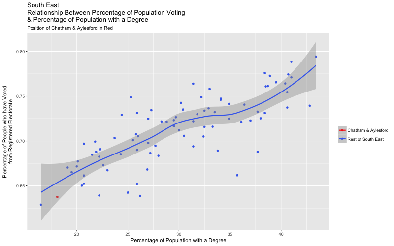
 
 My graph was created to demonstrate the relationship between the percentage of registered voters who turned up to vote, with the percentage of people with a degree. Each point on the graph represents a location with the South East constituency.
 
 A positive correlation can be seen between the two variables. If we assume on average, individuals with degrees are more intellegent than those who do not, we can say that the educated are more likely to vote in elections. Most of the individual locations fall under the range of the shaded area adjacent to the curve of best fit. However, do note that there are still a few places on the outskirts, and this suggests that the correlation might be positive, but not strongly positive.
 
### Dan

 531        Stalybridge & Hyde
 
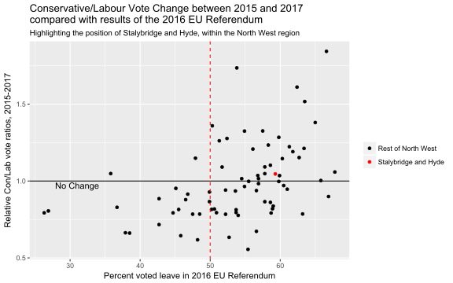
 
For my plot, I used data for the change in voting behavior between the 2015 and 2017 UK General Elections from the Labour Party to the Conservative Party - where a ratio greater than 1 implies a swing to the Conservatives and a ratio smaller than 1 implies a swing to Labour. It should be noted that 41% of constituencies in the North West of England swang to the Conservatives in the 2017 General Election. This is a very interesting split, as it highlights the complex nature of the 2017 General Election where there was not a simple swing from one party to the other, as there has been historically.

My plot compares this data against the estimated constituency results from the 2016 EU Referendum. I have then added two lines onto the plot, which separates the plot into 4 sections: constituencies that swang to Labour and voted Leave; constituencies that swang to Labour and voted Remain; constituencies that swang to the Conservatives and voted Leave; and constituencies that swang to the Conservatives and voted Remain.

It is interesting to note that there appears to be a weak positive correlation between the swing to the Conservatives in the 2017 General Election and the strength of the Leave vote in the 2016 EU Referendum. This is as expected; and there are only 2 constituencies in the North West that voted Remain and saw a swing to the Conservatives in 2017! However, when looking at constituencies that swung to Labour in 2017, there appears to be no bias in the level of support for Leave in the referendum - in particular 41% of these constituencies voted Remain. 

### Declan

 562                  Tamworth
 
 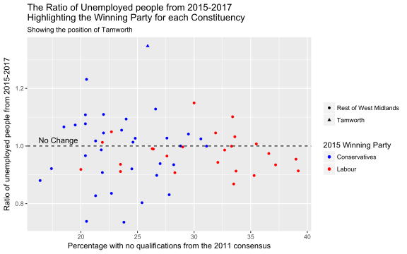
 
 My plot shows the relationship between the ratio of unemployment and the percentage of people with no qualifications. On the graph is also the winning parties for each constituency. Without this additional data there would not be much to be said about the data.
 
 Purely by looking at the 'line of no change' and comparing between Labour and the Conservatives it is quite clear to see that we have differing observations. For the Conservatives the number of constituencies that have increased their number of unemployed people, is roughly equal to the number of constituencies that have decreased the number of unemployed. Whereas the Labour party's constituencies have reduced the number of unemployed people in most cases. So the graph shows that Labour were far better at reducing the number of unemployed people per constituency.
 
We also can see that the 14 constituencies with the highest percentage of no qualifications all voted for Labour which shows another trend. This could be explained by Labour's slogan for the 2015 election: “Better Plan for a Better Future”, which may have swayed a few people towards a Labour vote.

The region I looked at, Tamworth, was in fact the worst constituency in terms of ratios of unemployment. It has a fairly similar percentage of people who were unemployed as other constituencies so there must have been other reasons that caused this.
 
### Diana

 391               Meon Valley
 
 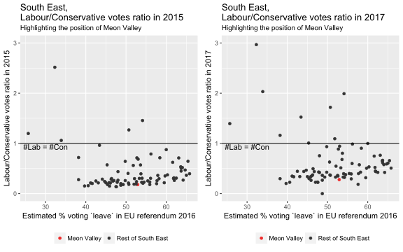
 
 These two plots show, for all 84 constituencies in the South East region, the relationship between electoral preferences(between Labour and Conservative parties, at the 2015 and 2017 General Elections), expressed by the ratio of votes for the respective parties and the percentage of people who voted "leave" in the 2016 EU referendum. The left plot is concerned with the 2015 General Elections and the right one with the 2017 General Elections.
 
 Firstly, we notice that in both years the majority of the constituencies have overall voted Conservative over Labour, with a lot of them under the 0.5 horizontal line, which implies more than twice as much votes for the Conservative party. We also observe that in most constituencies more than 50% of people have voted “leave” in the referendum and only in a few, people who voted “leave” were a minority. Those constituencies, in particular, have overall supported the Labour party in 2015 and even strongly in 2017.
 
 At first look of the graphs, one might observe a slight change in the voters’ preferences from 2015 to 2017 in favour of the Labour party. However, this is not a suitable plot to draw such conclusions from, so we might want to look into relative Lab/Con vote ratios for the two years for that region.
 
 Finally, Meon Valley, highlighted in red, appears to be a typical constituency from the South East region with about 53% of its representatives voting “leave” in the EU referendum.
 
 
### Dominic

 599          Warrington North
 
 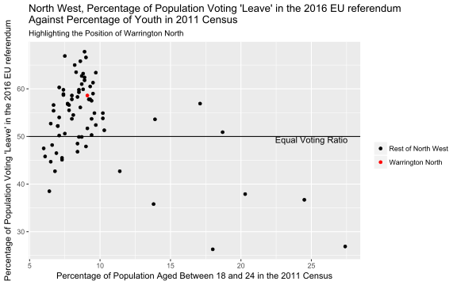
 
This plot shows, for all constituencies in the North West region, the relationships between the percentage of population that voted for UK to leave EU in the EU Referendum 2016 and the percentage of people aged between 18 and 24 according to the 2011 census.

The first thing that we can immediately notice from the graph is that most of the constituencies have low percentage of youth, except for a few cases. This is as expected as it agrees with the general demography of the UK population. The few outliers are most likely due to them being a student hub, which is therefore normal to have more youths between age 18 and 24.

For constituency with low percentage of youth, there is a positive relationship between the percentage of population that voted for 'Brexit' and the percentage of population aged between 18 and 24 in the 2011 census. It might be surprising to see that the areas with more youth has a higher percentage of population that voted to leave EU, especially when most youth are reported to be 'pro-Bremain'. This could be due to the fact that not many young people voted in the EU Referendum 2016, thus giving greater voting weightage to the older demographics, which might have had greater tendencies to be pro-Brexit. 

In most of the constituency where percentage of youth is extremely high, there percentage of population that voted leave was very low. This might be due to the fact that there are more youths in these areas who are more likely to be pro-Bremain compared to older demographics who are more likely to be pro-Brexit.

However, we should note that there is no definitive answer on how many percentage of youth that voted or if they would vote to leave or remain in the EU. We also have to note that this group of youth would be between the age 23 and 29 during the year 2016, when the EU referendum was taken place.

As shown in the graph, majority of the constituencies in the North West region had over 50% of their population that voted to leave EU in the EU Referendum 2016. That is, over 50% of the population in these constituencies are in favour of leaving EU. However, this does not show the overall population of the North West region and its general preferences to the result of the EU referendum. as the size of constituency are not equal and not represented by the graph.
 
### Florence

 237             Enfield North
 
 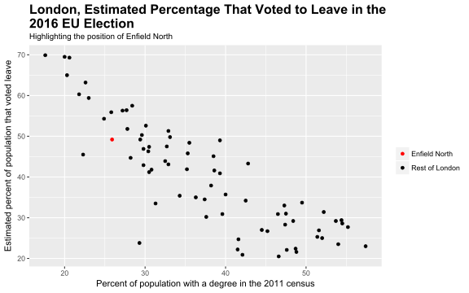
  
This plot shows the relationship between the estimated percentage of voters voting to leave in the 2016 EU election and the percentage of the population with a degree in the 2011 census, for the London region with Enfield North highlighted in red. 
  
A negative correlation is shown in the plot, with the estimated percent of the population that voted leave being highest in the constituencies with the lowest percentage of the population with a degree. Moreover, the lower estimated percentages voting leave occurs in the constituencies with the highest percentage of the population with a degree. The Enfield North constituency has a lower percentage of the population with a degree than the majority of the London constituencies. With an estimation of just under 50% of the population voting to leave, Enfield North fits with the overall trend of the plot.

### Isaac

 184            Derbyshire Mid
 
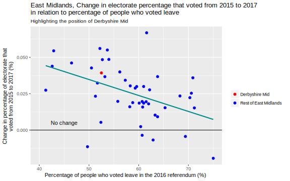

My graph shows the relation between the change in between voter turnout (total votes divided by total people on electoral register) and the percentage of population that voted leave. 

As 0 shows no change in voter turnout it is immediately evident that in the majority of constituencies, voter turnout increased. With several constiuencies seeing a 5% increase in voter turnout, while sevral others saw small drops. 
It is also clear that most constituencies in the East Midlands voted in majority to leave the EU.
A negative correlation was identified between percentage of those who voted yes in the referendum and expected increase in voter turnout. In effect this means if a constiuency voted in majority to stay in the EU then they would see a higher increase in expected voter turnout. And if a constituency voted in majority to leave the EU then there voter turnout was likely to increase but not by as much. 

### Jamie

 432           Nottingham East
 
 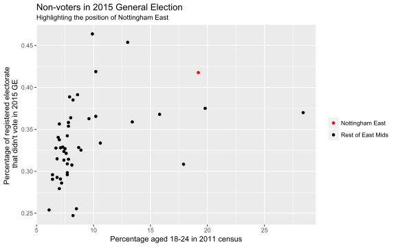
 
 Young voter turnout is often very low in elections, so it is not surprising to see that there is a positive correlation between non-voting and there being a lot of young people in a constituency.

Nottingham East had a very high number of people aged 18-24 compared to other constituencies in the 2011 census and also had a very high percentage of non-voters in the 2015 General Election.

### Kevin

 293 Harrogate & Knaresborough

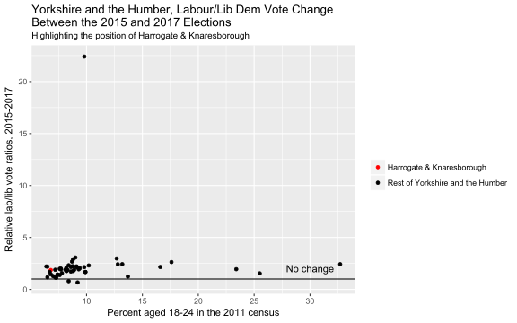

It can be observed that in all but two constituencies (Rotherham and Wentworth & Dearne) the labour to lib dem voter ratio has increased. In particular, Rotheram and Wentworth & Dearne both have very small lib dem vote share compared to labour's vote share.

Interestingly, there is a constituency, Bradford East, where the relative vote ratio is up to 22.4. Looking carefully at the data, this is mainly because the Lib Dems only retained 6.89% of their 2015 votes (a drop of 27.7 percentage points in absolute terms), whilst labour had a gain of 54.5% of their 2015 votes (an increase of 18.7 percentage points in absolute terms). This extraordinary change may be due to Lib Dem's 2015 candidate decided to stand as an Independent, retaining a 7.8% vote share in 2017.

We can observe that Harrogate fits well into the pattern for the relative vote ratio, with a value of 1.86. Although in this constituency, there was a gain in Lib Dem votes, there had been an even larger gain for labour, in both relative and absolute terms. Moreover, Harrogate was the only constituency in the whole region where the Lib Dem vote was higher than the Labour vote in 2017! This compared to 2015 when the Lib Dems had two seats in this region - Greg Mulholland in Leeds North West and Nick Clegg in Sheffield Hallam.

### Kishan

  38                 Battersea

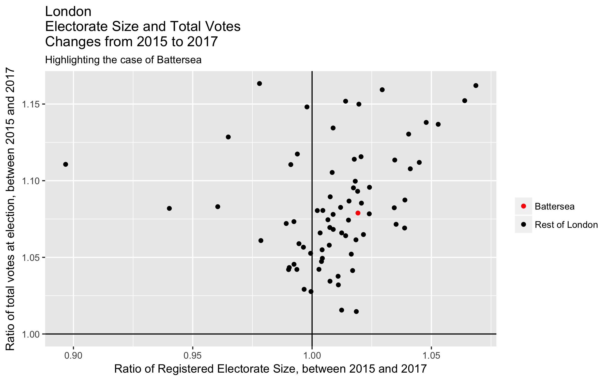

This plot shows, for all constituencies in the "London" region, the relationship between electorate size and the total number of votes counted. In particular, we are looking at the changes between the 2015 and 2017 general elections.

As expected, for all constituencies in which the registered electorate size increased, the total number of votes at election did as well. However in over a quarter of the "London" constituencies, where the electorate size decreased, we also saw an increase in the total number of votes counted (there were no "London" constituencies where the total votes decreased). The most extreme case showed an increase of votes by over 10%, alongside a decrease of electorate size by over 10%.

As for the Battersea case, highlighted in red in the plot, this constituency appears to be fairly typical as far as these two variables are concerned.

### Matt D

 591                 Wakefield

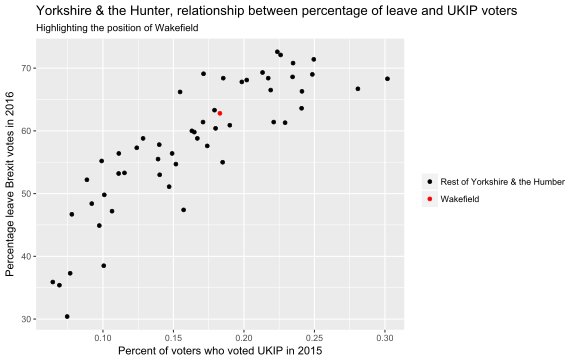

The graph shows, for all constituencies in Yorkshire and the Humber region, there is a positive relationship between the percentage of leave Brexit votes in 2016 and the percentage of UKIP voters in the general election of 2015. Wakefield specifically also follows this trend.

The likely reason for this relationship is that UKIP were extremely pro-Brexit, meaning that people that voted for them will likely have a similar opinion and will want to leave the EU.

It also appears that the majority of constituencies in Yorkshire and the Humber region were in favour for leaving the EU since they have more than 50% of voters voting leave. However, the percentage of people voting UKIP is extremely small, the most being a little over 0.3%. This is likely due to few people agreeing with the other extremist views despite the high percentage of pro-Brexit voters within the region.

### Matthew J

 482                 Rotherham
 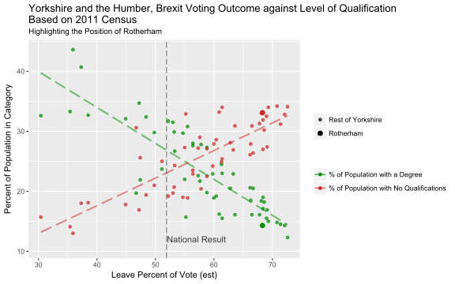
 
 This plot shows the relationship between the percentage of votes in a constituency to leave the European Union, against both the percentage of voters *who have a degree*, and the percentage of voters *with no qualifications* for **Yorkshire and the Humber.**

Overall Yorkshire residents were more likely to vote to leave the EU, since over two-thirds of constituencies delivered a result of above 51.9%, the national average. **Rotherham** follows to this trend, and its pro-Brexit stance is even significant among the rest of Yorkshire: with leave votes counting for **68.3%** of the ballot.

There appears to be a strong positive relation between the average level of education and training in a constituency, and the decision to remain the EU. Leave votes count for a small proportion of the total in areas where the proportion of people with degrees is higher than the regional average, and the proportion of those with no qualifications is lower.

It is important to note that the census used is 5 years old by time of Brexit vote, and the level of qualifications and degrees may have changed. Additionally, the Brexit vote percentages themselves have been esteemed as the votes were not cast on a constituency level.

### Miraj

 392                   Meriden
 
 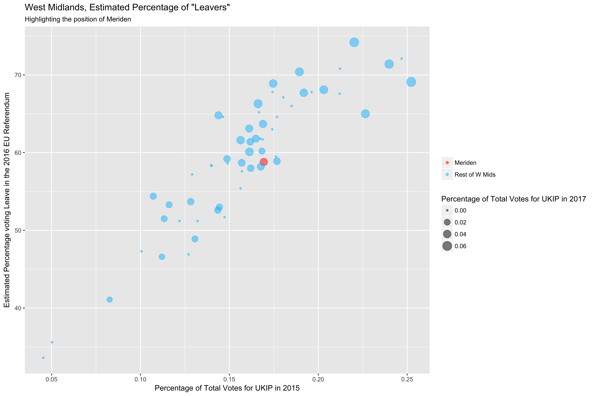
 
The plot above shows the the relationship between the estimated percentage of people who voted Leave in the 2016 EU Referendum and the percentage of each constituencies' total votes, that were in favour of UKIP in the 2015 General Election, for all constituencies in the West Midlands region. Additionally, the size of each point in the plot corresponds to the percentage of each constituencies' total votes that were in favour of UKIP in the 2017 General Election.

Since UKIP fought hard to advertise the advantages of Brexit, it's unsurprising to see positive correlation between voting for UKIP and voting to leave the EU, since many UKIP supporters in 2015 would have shared their party's view towards leaving the EU and voted accordingly. Meriden, highlighted in red in the plot, appears to follow the similar trend represented by other West Midlands constituencies.

Looking at the size of each point allows us to gauge how the popularity of UKIP has changed from 2015 to 2017. At first glance, it would be easy to suggest that in many constituencies, UKIP gained no votes at all, due to the percentage of total votes equalling 0%. However, it is important to consider how many of these constituencies actually had a UKIP candidate standing for a seat in Parliament. If every one of these constituencies had an UKIP candidate, then the lack of votes for UKIP clearly shows a decline in popularity for the party. On the other hand, if there were no candidates representing UKIP in these constituencies, then the percentage of votes in favour for UKIP does not give an accurate representation of the party's popularity with the public.

Assuming that all constituencies with 0% of votes in favour of UKIP, are constituencies where there was no candidate running on behalf of UKIP, it is interesting to see the decline in the party's representation within constituencies - which may be due to the public's opinion of UKIP. UKIP played a major role in the run up to the EU referendum, which may have increased support and caused a rise in the number of candidates representing UKIP in the 2015 election. However, once the Leave result was achieved, UKIP supporters may have then switched their support towards other parties, reducing the number of candidates running on behalf of UKIP in the 2017 election.

### Nathan

 252  Finchley & Golders Green
 

This graph provides information on the differences between Labour and Conservative votes in a particular London constituency. It should  be noted the performance of other parties are not considered, and that this does not mean voters are switching directly from Labour/Conservative or vice versa. 
Points below the line indicate that Labour improved their performance against the Conservatives, while above the line is the opposite. Those in the red square were Labour in both 2015 and 2017, those in blue the same but for Conservative. Those in the bottom right square changed their relative votes from Conservative to Labour in 2017.  

It shows that for the vast majority of London constituencies, Labour gained votes relative to the Conservatives in 2017, with 3 constituencies changing from having more Conservative votes to more Labour votes. 

Again, note this does not mean the constituencies elected Con or Labour MPs, just how they performed relative to eachother.  
The constituency almost directly on the horizontal line is Kensington, which DID change from Conservative MP to Labour MP in 2017, with only 20 votes difference.

### Ollie

 516                  Solihull
 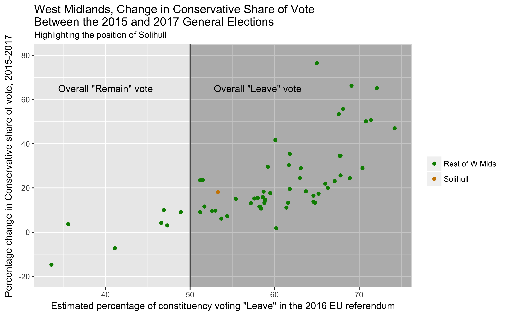
 
This plot shows the relationship between the change in the Conservative vote share (no. conservative votes divided by no. total votes, at the 2015 and 2017 General election) and estimated percentage of the electorate who voted leave in the EU referendum for the West Midlands.

29 of the 31 constituencies in the West Midlands saw an increase in the Conservative vote share. The highlighted constituency, Solihull, is no different in this.

It also appears that in constituencies where a higher percentage of the electorate voted “Leave” there was also a greater increase in the Conservative vote share. Again, Solihull, is fairly representative of this relationship.

### Tina

 136                 Charnwood
 
 
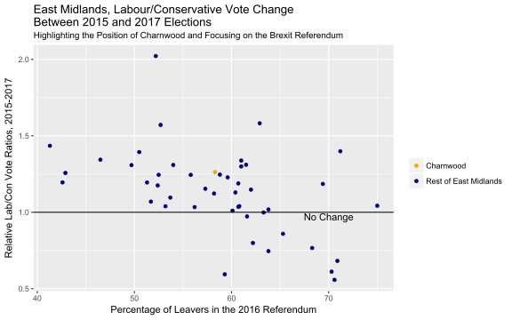

This is a plot of the East Midlands constituencies showing the relationship between electoral change, (between Conservative and Labour party; a higher value on the y-axis corresponds to gains for Labour relative to the Conservatives), during the 2015 and 2017 general elections and the percentage of the electorate who voted in each constituency for Brexit in the 2016 referendum. 

In the East Midlands, as the number of Brexiteers increases, Labour loses seats to the Conservatives. This is not surprising since the Labour party campaigned heavily to remain in the EU. 

In most of the East Midland constituencies Labour gained against Conservatives. *Charnwood*, highlighted in orange, seems to be a fairly typical constituency based on the data provided on these two variables.

### Zsigmond

 644               Wyre Forest

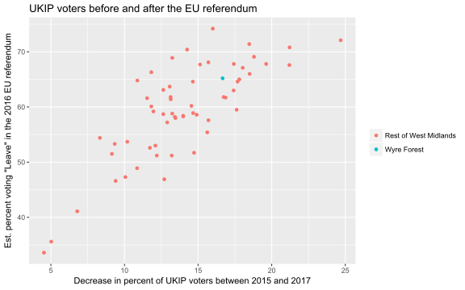

The plot above shows the relationship between the decrease in percent of people voting for the UK Independence Party (UKIP) between 2015 and 2017, and the estimated proportion of the population voting "Leave" at EU referendum in 2016.
Each datapoint represents a constituency of the West Midlands.

Before going into further details, following a sanity check, it can be confirmed that the minimum difference between the percent of UKIP voters by constituencies between 2015 and 2017 is a positive number, therefore it makes sense to apply that set of differences as a plot variable.

The scatterplot suggests a positive correlation between the two variables, which, knowing the party's stance on the issue of leaving the Europen Union, might seem contradictory.
After all, it implies that the constituancies with a higher proportion of people in favour of leaving the EU are happened to be the ones where the party has lost a larger proportion of their voters between 2015 and 2017.

A sensible explanation might be the party's limited presence in politics following the results of the referendum.
In this case, it's likely that the constituancies with a higher proportion of "leavers" were the ones where the party has gained a (proportionally) larger political base before 2016, hence losing respectively larger percents of their voters later.

Considering these particular variables, Wyre Forest, a West Midlands constituency, seems to be a quite normal datapoint within the set.
