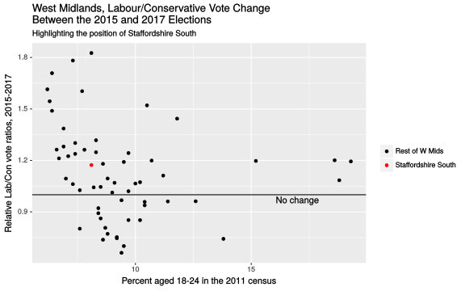
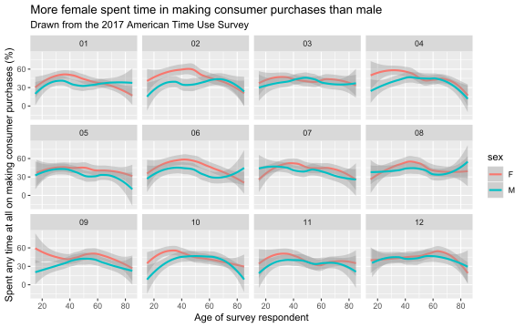

# A Set of Contributed Graphs with brief Commentary

## Authors

- David Firth
- Jia Le Lian

(add your name to the above list when you have contributed your file)

## The contributions

### DAVID F

    08 10 14

This plot shows how participation in religious and spiritual activity in the USA is different at different ages.  The graph is based on data from the 2017 American Time Use Survey, in which
respondents recorded how they spent all of their time on the day before they were interviewed.
The above graph shows the percentage of respondents, at different ages, who reported that they had spent any time at all on religious and spiritual activity on the day in question.

The graph shows how such participation increases from less than 10% of 20-year-olds, to 20% or more of the oldest survey respondents.  It should be noted that the data for the very oldest respondents --- those aged 80 and over --- is less reliable than at other ages, partly because of small numbers and partly because of the rounded recording of older ages in the published ATUS data.
    
**The above is just an illustrative example of the sort of graph and text you might include in this file.  I fully expect that some of the graphs you'll produce will be more interesting than this one!**

          	
### ALEXANDER

    01 06 13

### BAIYUN

    08 13 18    

### BENJAMIN A

    01 05 08
     
### BENJAMIN S

    10 13 18
    
### CHRISTOPHER

    10 14 16
    
### DANA

    05 12 18

### DANIEL

    03 05 11

### DANIUS

    06 11 14
    
### DAVID

    01 02 05
    
### DENIS

    02 03 12
    
### FAN

    06 11 16
    
### HARRISON

    05 15 16
    
### JAMES

    03 08 14
    
### JAN

    04 13 15
    
### JIA

    07 08 18
    
    
This plot illustrates the proportion of males and females who spent time on making consumer purchases by age, on a monthly basis. The data is taken from the 2017 American Time Use Survey, which recorded the time spent by individuals on the day before their interview. 

In general, the proportion of individual who spent time purchasing consumer goods increases with age, peaking at around 40 years old. This is followed by a downward slope as we move towards the 60-80 age range. This could be explained by elder people having restricted mobility compared to younger people, thus many of them no longer spent time on consumer purchases. 

It is also evident that, there is a larger proportion of female who spent time on making consumer purchases than male as the red lines are mostly above the blue lines. Besides, it is interesting to observe that there is a largest difference in proportion of men and women, aged between 20 and 40, who spent time on consumer purchases in February and April whereas, there is least difference in the proportion in May and December. 

It should be noted that there are more females who spent time on consumer purchases and data from those aged over 80 is less reliable because of rounding and there are only a small number of them. 

### LANGLANG

    02 11 18
    
### LEWEI

    01 06 08
    
### LUYING

    06 08 15
    
### MACIEJ

    12 16 18
    
### MAHIR

    04 06 16
    
### MARIIA

    02 06 11
    
### MAXIM

    12 13 16
    
### MICHAEL

    04 10 12
    
### MINWOO

    04 08 12
    
### NAIXUAN

    08 14 16
    
### NATHAN

    11 12 15
    
### NEEL

    04 07 15
    
### NICOLE

    02 06 11
    
### NIRAJ

    03 06 13
    
### OPEOLORUN

    05 16 18
    
### REECE

    09 10 12
    
### RICHARD

    04 11 12
    
### SAMUEL

    06 09 13
    
### SANDEEP

    02 04 15
    
### SOPHIE

    04 12 18
    
### TIMOTHY

    06 09 11
    
### XI

    03 05 06
    
### XINGWEI

    01 03 07
    
### YIWEN

    02 10 14
    
### YUE

    03 12 18
    
### ZECHI

    01 04 07
    
### ZILIN

    04 10 15

