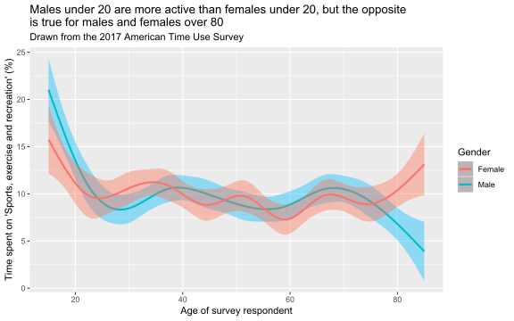
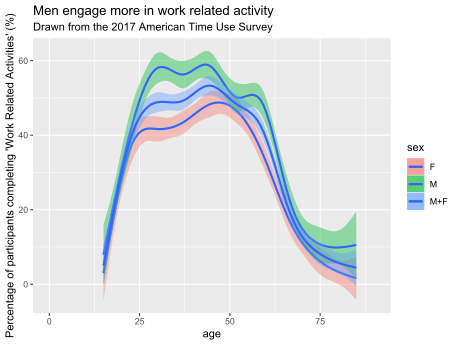
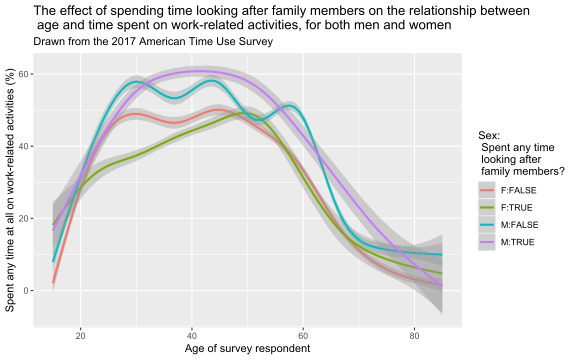
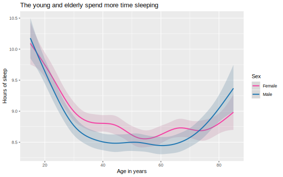
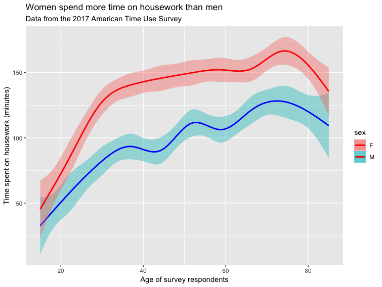
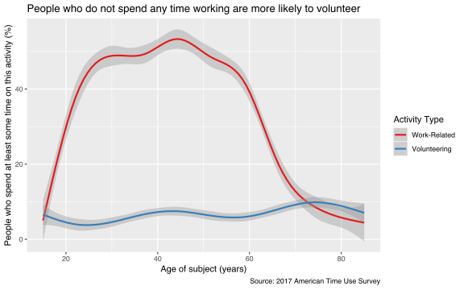
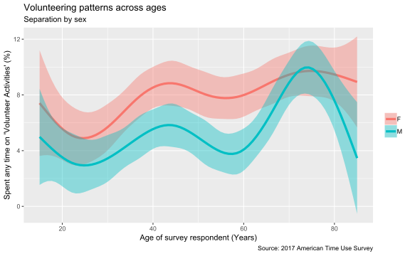
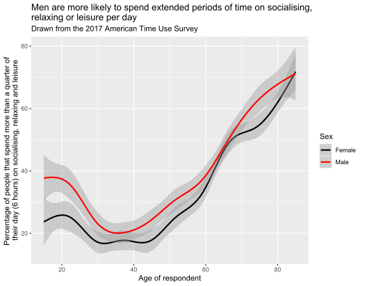

# A Set of Contributed Graphs with brief Commentary

## Authors

- David Firth
- Denis Akkavim
- Danius Backis
- Luying Bai
- Samuel Hine
- David Hooton
- Jia Le Lian
- Reece Mears
- Alexander Milanovic
- Dana Penistone
- Neel Sachania
- Daniel Timmers
- James Walsh
- Harrison Wilde
- (next name to be added here)

(add your name to the above list when you have contributed your file)

## The contributions

### DAVID F

    08 10 14

This plot shows how participation in religious and spiritual activity in the USA is different at different ages.  The graph is based on data from the 2017 American Time Use Survey, in which
respondents recorded how they spent all of their time on the day before they were interviewed.
The above graph shows the percentage of respondents, at different ages, who reported that they had spent any time at all on religious and spiritual activity on the day in question.

The graph shows how such participation increases from less than 10% of 20-year-olds, to 20% or more of the oldest survey respondents.  It should be noted that the data for the very oldest respondents --- those aged 80 and over --- is less reliable than at other ages, partly because of small numbers and partly because of the rounded recording of older ages in the published ATUS data.
    
**The above is just an illustrative example of the sort of graph and text you might include in this file.  I fully expect that some of the graphs you'll produce will be more interesting than this one!**

          	
### ALEXANDER

    01 06 13
    

The plot displayed above shows how the amount of time people spend on sports, exercise and recreation varies with age, as well as the influences that gender has on this relationship. The data used to generate the plot is from the American Time Use Survey compiled by the [Bureau of Labour Statistics](https://www.bls.gov/tus/), and can be downloaded [here](https://raw.githubusercontent.com/DavidFirth/lab3/master/atussum_2017.csv). The survey measures the amount of time people spend performing various activities, such as paid work, childcare, volunteering, and socialising.

The plot shows that the time spent on sports, exercise and recreation peaks between the ages of 15 and 25 and decays as people get older. This could likely be due to the fact that people normally have more free time when they are young. When we look at the curves for male and female respondents separately, we see that men are more active than women when they are young, but then women are more active than men between the ages of 75 and 85. In fact, women at the age of 85 spend about 160% more time on sports, exercise and recreation than men of the same age. However, it should be noted that 571 respondents of the total of 10,223 are between the ages of 80 and 85, which represents a proportion of 5.4%, compared to the most abundant age group being the one between 35 and 40 representing a proportion of 9.8% of the total. The difference, although large, should not alone be a reason to discard our previous conclusion, since 5.4% is only slightly below 6.67%, which is the proportion of respondents each category would have if they were assigned randomly (for categories of 5 years).

It is worth noting that the data for ages above 80 is aggregated to be either 80 or 85, most likely due to the fact that less people in that age range participated in the survey. Despite this, we do not expect that this will impact on our results, as we don't require the resolution of the age data to be 1 year.

### BAIYUN

    08 13 18    

### BENJAMIN A

    01 05 08
     
### BENJAMIN S

    10 13 18
    
### CHRISTOPHER

    10 14 16
    
### DANA

    05 12 18
    

  
The above graphic shows us the percentage of individuals who participated in any 'Work Related Activity', using data from the USA, based on 2017 American Time Use Survey, in which respondents recorded how they spent all of the time on the day before they were interviewed. The percentage refers to the percentage of participants who spent **any time at all** on work related activities on the dayin question.  Further, the graphic demonstrates how this varies with the sex of the individuals.  

From the graph, we can see that men are more likely to participate in 'work related activities' than woman at all ages - as the green (male) curve, exceeds that of the red (female) curve for all ages. For the entire collection of participants, work based activities are seen to increase from 20% to 40% from the ages of 20 to 25. It can also be seen that participating in 'work based activities' reaches a peak between 40 and 50 years of age; though the peak is slightly later for female individuals, and slightly earlier for male individuals. 

### DANIEL

    03 05 11
    

    
The plot shows how participation % in **work-related activities** varies with age in the USA. The graph is build using [data](https://raw.githubusercontent.com/DavidFirth/lab3/master/atussum_2017.csv) from the 2017 American Time Use Survey (ATUS). The ATUS dataset for 2017 records the amount of time spent by people, in one specific day, in each of 17 categories of activity. This [link](http://htmlpreview.github.io/?https://github.com/DavidFirth/lab3/blob/master/ATUS%20top-level%20time%20use%20categories.html) provides a short description of the 17 categories. 

The graph splits the data dependent on sex and whether the participant had spent *any time at all* on looking after family members. We can see that for the majority of ages, a higher proportion of men spend *any time at all* on work-related activities than women. This is arguably not a big surprise as the US, like most of the world, has a history of men being the household earners. Therefore the more interesting information from this graph is for women, in the 20-48 age range, it appears that part of the reasoning for low participation is because they are spending time looking after family members. For men we cannot make this conclusion as it very much depends on age. 

It should be noted that participants aged 81-84 and 85+ had their ages rounded to 80 and 85 respectively. However, this does not affect any conlusions made above.

### DANIUS  

   06 11 14
   
   

The graph above depicts the relationship between the average time spent on educational activities and the age of the respondents. As one would expect, the younger the respondent, the more they spend time educating themselves. The maximum is attained at 17 years old, when people spend on average 200 minutes per day on education, and then it drops quickly. 7 years later, less than 24 minutes per day are spent on education. It can also be noted that from 50 years old participants practically never spend time on education, which I found quite surprising. 

    
### DAVID

    01 02 05
    

The above graph shows how age and sex differences impact the participants' sleep, with data taken from the [American Time Use Survey.](https://www.bls.gov/tus/). Firstly, we can see that young people, teenagers in particular, slept for longer than any other age group. This is perhaps explained by not spending as much time working, as this age group also spends less time working than any other. The elderly also spend less time working, and more time sleeping, than most other age groups. However, they sleep less than young people, which can be explained by physical differences causing a need for less sleep. In fact, there is significant evidence of a negative correlation between work and sleep, with Pearson correlation coefficient r = -0.32.

Among those with ages 20-60, we see fluctuations in the data. Women in their 40s and 50s sleep less than women at any other point in their lives. A possible explanation for this is motherhood, although we would expect to see a dip earlier in their lives. Men also see a slight increase in sleep during this time. Overall, women sleep more than men, except for those that are very young and old.

It should be noted that the values in this chart seem very large, as the average time spent sleeping for all participants in 8 hours and 36 minutes, and the average for those under 20 is almost 10 hours. A Gallup [poll](https://news.gallup.com/poll/166553/less-recommended-amount-sleep.aspx) found that the average time a US person spends sleeping is 6.8 hours. I only used the category t010101: Sleeping for my graph, so any variation between these is due to the methodology of the studies.
    
### DENIS

    02 03 12
    

The plot shows the how the amount of time spent on housework changes as people age, divided by the gender of the survey respondents. The graph shows that, generally speaking, as one gets older, one tends to spend more time on housework - until one reaches their 70s, when the amount of time spent on housework reduces. Arguably, this should not come as much of a surprise - the older you are, the larger your house is likely to be, and the more time you will need to spend on housework. Furthermore, the elderly tend to be quite frail, and they simply may not be physically capable of spending the same amount of time as they used to spend on housework.

Most notably, we observe that at all ages, women spend more time on housework than men - which, depending on your point of view, may or may not come as a surprise. 

It is also worth noting that there is limited data on participants under the age of 18, and on participants over the age of 80.
    
### FAN

    06 11 16
    
### HARRISON

    05 15 16

Interestingly, when the variables are plotted using a similar methodology to the one followed by David, the two variables begin to insinuate a potentially more complex relationship. The graph depicts smoothed curves of the percentage of people at each age value who participate in each activity for at least some amount of time.

The curve for volunteering related activities has notable increases around the ages of 20 and below, as well as beyond 60-65 which is a fairly standard retirement age. This could be attributed to young people, namely students and people yet to start working full time, having more time to volunteer. Similarly, older people who have retired will also have more time to volunteer.

The percentage of people volunteering falls from around 7% to a low point of almost 3% in mid to late 20 year olds which could signify a significant loss of free time as people start families and careers at this age. It is also interesting to observe a bump in the mid-40's (also observable in time spent working, perhaps as people reach the middle of their life and feel pressured to contribute to something external, be it work or volunteering) followed by an even larger bump at ages beyond 65 where a height of around 10% of people volunteering is reached among assumed retirees.

The general pattern of the data is clear in that the majority of time spent is on working between the ages of 20's to 60's, as would be expected intuitively. It is unfortunate that the numbers of people volunteering and time spent volunteering is significantly lower than that of people working. Though the way in which people split their time does indeed suggest a conclusion of a weak relationship between people who work less having a higher probability of spending at least *some* time volunteering.
 
### JAMES

    03 08 14
    

The above figure conveys an inequality in both gender and age of individuals caring for members within the American home. Participants of the 2017 American Time Use Survey (ATUS) were expected to note how many hours of the day before their interview they had spent on various tasks. In the graph, we may see the proportion of the total reported hours directed to this care, split by age and sex.

Of all reported hours caring for others within their home, across almost all ages, females (grey) report a higher number of hours than males (pink). Secondly, younger woman (25-35) spend considerably more time on this task than men of the same age range. Interestingly, men do show a clear peak in their late thirties, perhaps correlated to their aging parents seeking their help. The trend lines are provided solely for illustrative purposes of indicating the distinct differences in proportions, as they have not been statistically scrutinized. Similarly, the tails of these rough distributions, and hence these data, should be considered somewhat unreliable due to small sample size within these age ranges.

    
### JAN

    04 13 15
    
### JIA

    07 08 18
    

This plot illustrates the proportion of males and females who spent time on making consumer purchases by age, on a monthly basis. The data is taken from the 2017 American Time Use Survey, which recorded the time spent by individuals on the day before their interview. 

In general, the proportion of individual who spent time purchasing consumer goods increases with age, peaking at around 40 years old. This is followed by a downward slope as we move towards the 60-80 age range. This could be explained by elder people having restricted mobility compared to younger people, thus many of them no longer spent time on consumer purchases. 

It is also evident that, there is a larger proportion of female who spent time on making consumer purchases than male as the red lines are mostly above the blue lines. Besides, it is interesting to observe that there is a largest difference in proportion of men and women, aged between 20 and 40, who spent time on consumer purchases in February and April whereas, there is least difference in the proportion in May and December. 

It should be noted that there are more females who spent time on consumer purchases and data from those aged over 80 is less reliable because of rounding and there are only a small number of them. 

### LANGLANG

    02 11 18
    
### LEWEI

    01 06 08
    
### LUYING

    06 08 15
    
    
    
    This plot shows how participation in volunteer activities in the USA is different at different ages.  The graph is based on data from the 2017 American Time Use Survey, in which respondents recorded how they spent all of their time on the day before they were interviewed.
    The above graph shows the percentage of respondents, at different ages and genders, who reported that they had spent any time at all on religious and spiritual activity on the day in question.
    The graph shows that for female respondents, the proportion of time spent on volunteer activities remains in the same level at around 13% except for the age 30s, where illustrates a small, drop, decreasing to 8%. Similarly, the data of male participants also witness a drop in their 30s, from 9% to 5%. However, different from the data of female participants, there is a significant peak of the percentage of time spent by male respondents on volunteer activities, rising sharply to 17% and then drop to 4%.
    In conclusion, for most of the ages, female participants spend more time on volunteer activities than male participant except for the men st the age of 72.
    
### MACIEJ

    12 16 18
    
### MAHIR

    04 06 16
    
### MARIIA

    02 06 11
    
### MAXIM

    12 13 16
    
### MICHAEL

    04 10 12
    
### MINWOO

    04 08 12
    
### NAIXUAN

    08 14 16
    
### NATHAN

    11 12 15
    
### NEEL

    04 07 15
    

This plot shows how participation in volunteering activities in the USA varies for different ages. The graph is produced using data from the 2017 American Time Use Survey (ATUS), in which data has been collected to better understand how time is divided across different activities. The above graph shows the percentage of respondents, of different ages, separated by sex who had spent any time at all on volunteering activites. These include a range of activities such as performance, cultural, administrative, care and maintenance activities.   

The graph shows, that the participation percentage for each sex spending any time on volunteering activities follows a similar trend up until the age of 60. From this age, the percentage of male participation in volunteering activities increases significantly, which may correspond to the age of retirement. The peak participation occurs at approximately 73 years of age for both males and females, where roughly 10% of both sexes participate in volunteering activities. It must be noted that the ages of respondents greater than or equal to 80 have been rounded to the ages of 80 or 85, making it less reliable for drawing conclusions. 
    
### NICOLE

    02 06 11
    
### NIRAJ

    03 06 13
    
### REECE

    09 10 12
    

The plot shows how likely different ages of both males and females are to spend more than eight hours per day on socialising, relaxing and leisure per day. The bands around each line show a 95% confidence interval for each of the fits. Time spent on each activity was recorded as part of the 2017 American Time Use Survey.

From the graph, we can see a global trend of people being less likely to spend a quarter of their day socialising around the ages of 30-60; this is perhaps due to most people in this age bracket being employed. The most surprising conclusion to draw is that people over the age of 70 are more likely than not to spend at least 6 hours socialising (as the percentage for males and females exceeds 50%), and in fact by the age of 85, the graph suggests there is a 70% chance. This may be due to a smaller sample size, or rounding in the data, but the result does not seem to be anomalous. It is also interesting how sex does not appear to offer any new trends in the data: the overall trend for both curves is very similar, however that for men is consistently higher, especially for younger ages.
    
### RICHARD

    04 11 12
    
### SAMUEL

    06 09 13
    

    
The plot shows the proportion of time people spend on sports and recreation as opposed to education. Note that only people included in this plot are those who _are_ in education. All respondents were specified to have an age under 25, so the graph isn't clouded by the many ages that are not in education. 
The graph shows that males between the 15-17 age bracket spend far more on recreational activites, since the values for these ages fall above the 0.5 line. As the age increases, the proportions through the ages fall together; reason for this could include and increase in difficulty relating to higher eduation.
For females however, the proportion does not change much over time, perhaps due to female students being more motivated in school.
    
### SANDEEP

    02 04 15
    
### SOPHIE

    04 12 18
    
### TIMOTHY

    06 09 11
    
### XI

    03 05 06
    
### XINGWEI

    01 03 07
    
### YIWEN

    02 10 14
    
### YUE

    03 12 18
    
### ZECHI

    01 04 07
    
### ZILIN

    04 10 15

